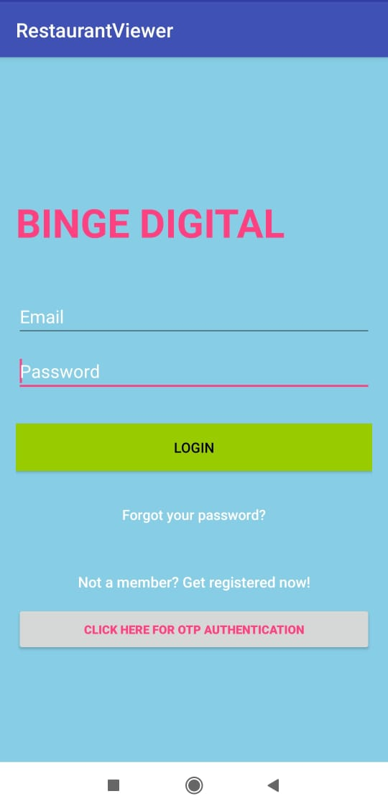
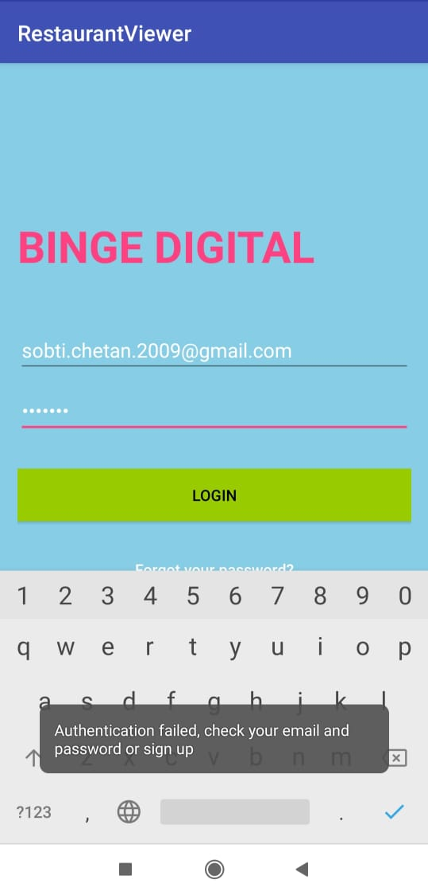
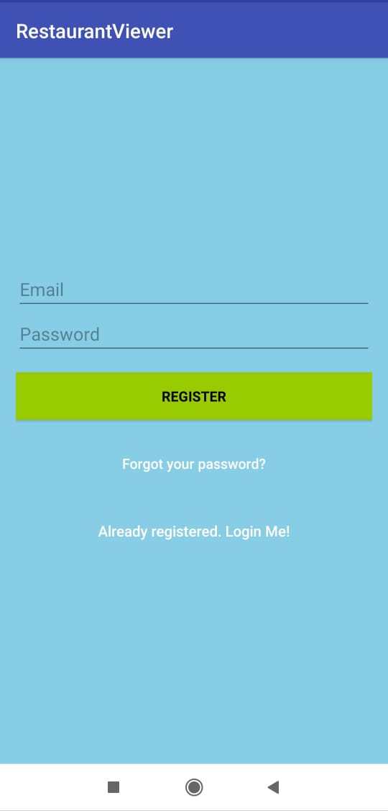
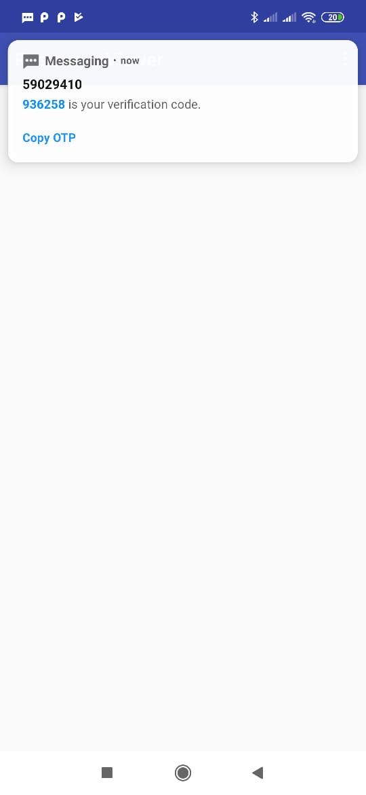
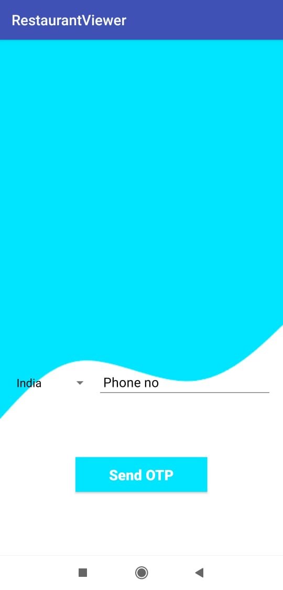
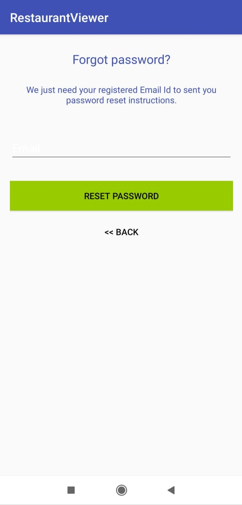
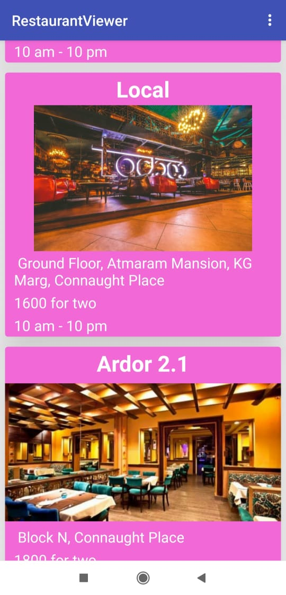
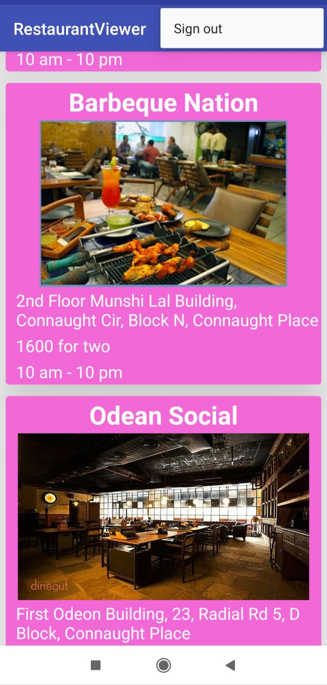

# RestaurantViewer
It is a restaurant viewer application made on a small scale using firebase database.
It has authenticaton facilities like email password verification and also supports OTP authentication.
After successful login the user can view the list of few restaurants in Connaught place, Delhi.
The recycler view diplaying information about the restaurant is populated from firebase database.
One can signout and exit the application too.

